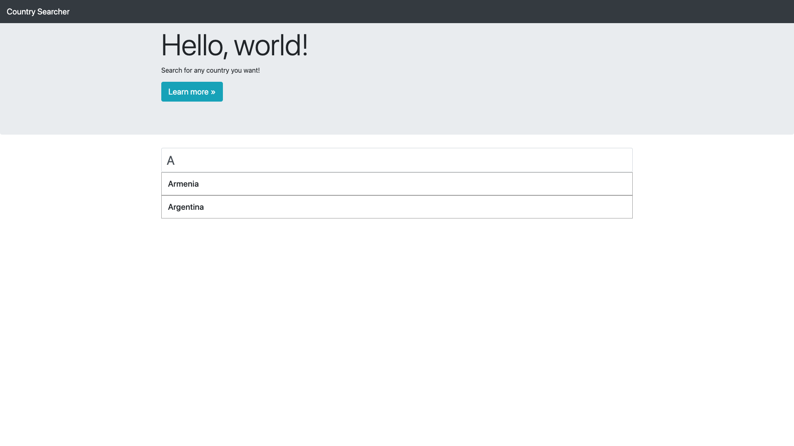

# CountrySearchBar
A simple webpage with a user friendly searchbar that auto generates suggestions as the user types. The webpage makes constant callbacks to check with the database to see if their is a value matching the user's input and displays all the results that have starting like value. 

# What I learned
* AJAX Callbacks
* JQuery Keyup
* SQL Queries
 
# Screenshots

